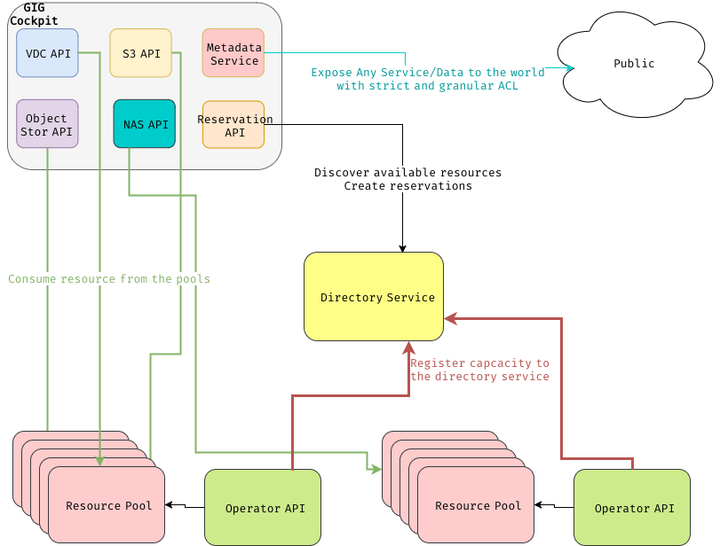

# GIG Cockpit

The GIG cockpit is a set of APIs that let you create and consume services from a G8OS grid.
### APIs:
- [VirtualDataCenter API](https://github.com/gig-cockpit/VDC-API): This API let you deal with virtual machine and container.
- [S3 API](https://github.com/gig-cockpit/S3-API): This API let you deploy S3 compatible servers
- [NAS API](https://github.com/gig-cockpit/NAS-API): This API let you deploy NAS (Network Area Storage).
- [Metadata API](https://github.com/gig-cockpit/metadata-API): This is a generique API that let you expose any piece of information to the world. It proposes an easy to use ACL system that let you define who can see what.

All these API have been designed using [Raml 1.0](http://raml.org/).  You will find a link to the html representation of the API in each README of the repositories.

## High level architecture

